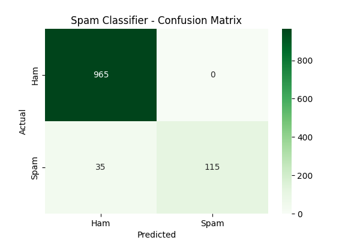
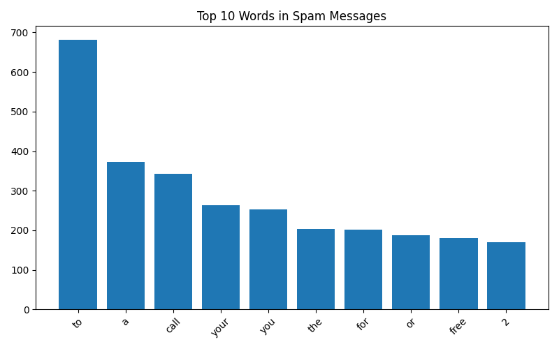

# Spam Email Classifier

A Machine Learning project that detects spam emails using Naive Bayes and TF-IDF vectorization.

## Accuracy

96.86%

## Tech Used

- Python
- Scikit-learn
- Pandas
- Matplotlib
- Seaborn

## How it Works

1. Load SMS Spam Collection dataset (5574 messages)
2. Convert text to numbers using TF-IDF
3. Train Naive Bayes classifier
4. Achieved 96.86% accuracy on test data

## Results

## Confusion Matrix

## Top Spam Words

## Author

## Pratiksha Shivsharne
